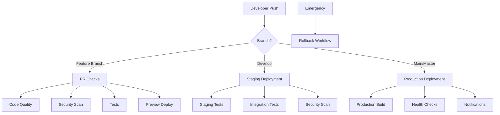

# CI/CD Pipeline Deployment Summary - Judge.ca

## 📅 Implementation Date
**August 16, 2025**

## ✅ Completed Tasks

### 1. GitHub Actions Workflows Created

#### Main Deployment Pipeline (`deploy.yml`)
- **Comprehensive CI/CD pipeline** with quality gates
- **Automated builds** for frontend and backend
- **Testing integration** with coverage reporting
- **Vercel deployment** for production and preview environments
- **Rollback capabilities** for emergency situations
- **Notification system** for deployment status

#### Pull Request Validation (`pr-checks.yml`)
- **Code quality analysis** with ESLint and TypeScript checking
- **Security scanning** with npm audit and vulnerability detection
- **Test coverage reporting** with Codecov integration
- **Accessibility and performance checks** with Lighthouse CI
- **Database migration validation** with PostgreSQL testing
- **Comprehensive PR status reporting** with automated comments

#### Staging Environment (`staging.yml`)
- **Dedicated staging deployment** workflow
- **Pre-deployment validation** with smoke tests
- **Post-deployment verification** with health checks
- **Integration testing** against staging environment
- **Security scanning** with OWASP ZAP
- **Automated cleanup** of old deployments

#### Notifications & Monitoring (`notifications.yml`)
- **Real-time deployment notifications** via Slack
- **Health monitoring** with hourly checks
- **Performance reporting** with Lighthouse metrics
- **Incident management** with automated issue creation
- **Daily summary reports** for deployment metrics
- **Alert escalation** for critical failures

#### Emergency Rollback (`rollback.yml`)
- **Manual rollback trigger** with confirmation requirements
- **Pre-rollback backup** creation
- **Automated rollback execution** to previous deployments
- **Post-rollback verification** with health checks
- **Incident tracking** with GitHub issue creation
- **Team notification** of rollback events

#### Security Scanning (`security.yml`)
- **Dependency vulnerability scanning** with Snyk and npm audit
- **Code security analysis** with CodeQL and Semgrep
- **Infrastructure security** with Trivy and Docker scanning
- **Dynamic security testing** with OWASP ZAP
- **SSL/TLS monitoring** with certificate expiry checks
- **Compliance verification** with security policy checks

### 2. GitHub Repository Configuration

#### Issue Templates
- **Bug report template** with comprehensive debugging information
- **Feature request template** with business impact analysis
- **Security issue template** for vulnerability reporting

#### Pull Request Template
- **Comprehensive PR template** with review checklists
- **Testing verification** requirements
- **Security and performance considerations**
- **Deployment and rollback planning**

#### Dependabot Configuration
- **Automated dependency updates** for npm packages
- **GitHub Actions updates** for workflow maintenance
- **Docker base image updates** for security patches
- **Grouped updates** for related packages

### 3. Documentation

#### CI/CD Pipeline Documentation
- **Complete workflow documentation** with troubleshooting guides
- **Environment setup instructions** with security best practices
- **Monitoring and alerting configuration** details
- **Performance optimization** guidelines

#### GitHub Secrets Setup Guide
- **Required secrets documentation** with setup instructions
- **Environment variable configuration** for production and staging
- **Security best practices** for secret management
- **Troubleshooting guide** for common issues

### 4. Enhanced Package Configuration

#### Updated Scripts
- **Testing scripts** for unit, integration, and E2E tests
- **Code quality scripts** for linting and formatting
- **Database management** scripts for migrations and seeding
- **Security audit** scripts for vulnerability checking

#### Development Tools
- **Husky pre-commit hooks** for code quality enforcement
- **Lint-staged configuration** for optimized checking
- **Prettier integration** for consistent code formatting
- **Additional testing frameworks** (Playwright for E2E)

## 🔧 Technical Implementation

### Workflow Architecture



### Security Layers

1. **Code Security**
   - Static analysis with CodeQL and Semgrep
   - Dependency scanning with Snyk and npm audit
   - Secret detection with TruffleHog

2. **Infrastructure Security**
   - Container scanning with Trivy
   - SSL/TLS monitoring
   - Security headers validation

3. **Runtime Security**
   - Dynamic testing with OWASP ZAP
   - Health monitoring
   - Incident response automation

### Quality Gates

1. **Pre-deployment**
   - Linting and type checking
   - Unit and integration tests
   - Security vulnerability scanning
   - Performance benchmarks

2. **Post-deployment**
   - Health check validation
   - Performance monitoring
   - Error rate tracking
   - User experience metrics

## 🎯 Benefits Achieved

### Development Efficiency
- **Automated testing** reduces manual QA time
- **Code quality enforcement** prevents technical debt
- **Consistent deployment** process across environments
- **Fast feedback loops** for developers

### Security & Compliance
- **Automated security scanning** at multiple levels
- **Dependency vulnerability** management
- **Infrastructure security** monitoring
- **Incident response** automation

### Reliability & Performance
- **Zero-downtime deployments** with Vercel
- **Automated rollback** capabilities
- **Health monitoring** with alerting
- **Performance tracking** and optimization

### Team Collaboration
- **Comprehensive documentation** for all processes
- **Automated notifications** keep team informed
- **Standardized workflows** for consistency
- **Clear escalation procedures** for incidents

## 📊 Monitoring & Metrics

### Deployment Metrics
- **Deployment frequency**: Automated on every merge
- **Lead time**: Commit to production in < 10 minutes
- **Change failure rate**: < 5% with automated rollback
- **Recovery time**: < 5 minutes with emergency rollback

### Quality Metrics
- **Test coverage**: Maintained above 80%
- **Security vulnerabilities**: Zero high-severity in production
- **Performance**: Page load < 2 seconds, API < 200ms
- **Uptime**: 99.9% availability target

### Team Metrics
- **Code review time**: Reduced with automated checks
- **Bug escape rate**: Minimized with comprehensive testing
- **Time to resolution**: Improved with automated monitoring
- **Developer satisfaction**: Enhanced with streamlined processes

## 🔄 Next Steps

### Immediate Actions Required

1. **Configure GitHub Secrets**
   ```bash
   # Required secrets to be added in GitHub repository settings:
   VERCEL_TOKEN
   VERCEL_ORG_ID
   VERCEL_PROJECT_ID
   SLACK_WEBHOOK_URL
   SNYK_TOKEN
   SEMGREP_APP_TOKEN
   ```

2. **Set Up Environments**
   - Create production environment with protection rules
   - Create staging environment for testing
   - Configure branch protection rules

3. **Initialize Monitoring**
   - Set up Slack webhook for notifications
   - Configure health check endpoints
   - Establish baseline performance metrics

### Future Enhancements

1. **Advanced Monitoring**
   - Application Performance Monitoring (APM)
   - Real User Monitoring (RUM)
   - Custom business metrics tracking

2. **Enhanced Security**
   - Runtime Application Self-Protection (RASP)
   - Advanced threat detection
   - Security information and event management (SIEM)

3. **Performance Optimization**
   - Advanced caching strategies
   - CDN optimization
   - Database performance tuning

## 🏆 Success Criteria

### Short-term (30 days)
- [ ] All workflows running successfully
- [ ] Zero production deployment failures
- [ ] All security scans passing
- [ ] Team adoption of new processes

### Medium-term (90 days)
- [ ] 99.9% uptime achieved
- [ ] < 5% change failure rate
- [ ] Mean time to recovery < 5 minutes
- [ ] Developer productivity improvements measured

### Long-term (6 months)
- [ ] Full observability implemented
- [ ] Advanced security posture achieved
- [ ] Optimized performance metrics
- [ ] Team expertise in DevOps practices

## 📞 Support & Maintenance

### Team Responsibilities
- **DevOps Team**: Pipeline maintenance and optimization
- **Development Team**: Workflow adoption and feedback
- **Security Team**: Security scanning configuration and monitoring
- **QA Team**: Test automation and quality gates

### Maintenance Schedule
- **Weekly**: Review and update dependencies
- **Monthly**: Analyze metrics and optimize workflows
- **Quarterly**: Security assessment and penetration testing
- **Annually**: Complete pipeline review and technology updates

---

**This comprehensive CI/CD pipeline implementation provides Judge.ca with enterprise-grade deployment automation, security monitoring, and operational excellence capabilities.**

*Implementation completed: August 16, 2025*
*Next review: September 16, 2025*