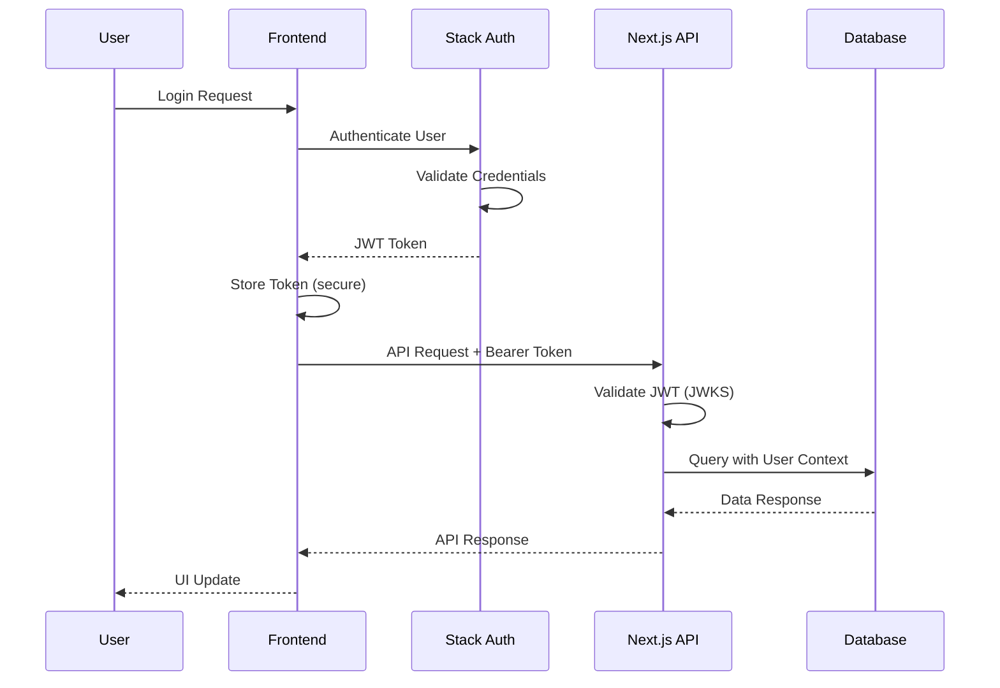

# WisdomOS Web Architecture Documentation

[](https://github.com/your-org/wisdomos-web)
[](https://github.com/your-org/wisdomos-web)

This document provides a comprehensive overview of the WisdomOS Web system architecture, including design decisions, data flow, security considerations, and scalability patterns.

## Table of Contents

- [System Overview](#system-overview)
- [Architecture Patterns](#architecture-patterns)
- [Technology Stack](#technology-stack)
- [Database Design](#database-design)
- [API Architecture](#api-architecture)
- [Frontend Architecture](#frontend-architecture)
- [Authentication & Authorization](#authentication--authorization)
- [Data Flow](#data-flow)
- [Security Architecture](#security-architecture)
- [Performance Considerations](#performance-considerations)
- [Scalability Patterns](#scalability-patterns)
- [Deployment Architecture](#deployment-architecture)
- [Monitoring & Observability](#monitoring--observability)
- [Future Considerations](#future-considerations)

## System Overview

WisdomOS Web is a full-stack web application built using modern web technologies with a focus on simplicity, scalability, and user experience. The system follows a **serverless-first architecture** using Next.js API routes and Neon's serverless PostgreSQL database.

### High-Level Architecture

```
┌─────────────────────────────────────────────────────────────────────┐
│                           Frontend Layer                            │
│  ┌─────────────────┐ ┌─────────────────┐ ┌──────────────────────┐  │
│  │   React 19      │ │  Tailwind CSS   │ │   TanStack Query     │  │
│  │   Components    │ │   Styling       │ │   State Management   │  │
│  └─────────────────┘ └─────────────────┘ └──────────────────────┘  │
└─────────────────────────────────────────────────────────────────────┘
                                   │
                               HTTPS/API
                                   │
┌─────────────────────────────────────────────────────────────────────┐
│                        Application Layer                            │
│  ┌─────────────────┐ ┌─────────────────┐ ┌──────────────────────┐  │
│  │   Next.js 15    │ │   API Routes    │ │    Middleware        │  │
│  │   App Router    │ │   (Serverless)  │ │   Authentication     │  │
│  └─────────────────┘ └─────────────────┘ └──────────────────────┘  │
└─────────────────────────────────────────────────────────────────────┘
                                   │
                            Database API Calls
                                   │
┌─────────────────────────────────────────────────────────────────────┐
│                           Data Layer                                │
│  ┌─────────────────┐ ┌─────────────────┐ ┌──────────────────────┐  │
│  │   Neon Data API │ │   PostgreSQL    │ │    Row Level         │  │
│  │   (REST API)    │ │   Database      │ │    Security          │  │
│  └─────────────────┘ └─────────────────┘ └──────────────────────┘  │
└─────────────────────────────────────────────────────────────────────┘
                                   │
                              External Services
                                   │
┌─────────────────────────────────────────────────────────────────────┐
│                         External Layer                              │
│  ┌─────────────────┐ ┌─────────────────┐ ┌──────────────────────┐  │
│  │   Stack Auth    │ │   Netlify CDN   │ │    Analytics         │  │
│  │   (Identity)    │ │   (Hosting)     │ │    (Future)          │  │
│  └─────────────────┘ └─────────────────┘ └──────────────────────┘  │
└─────────────────────────────────────────────────────────────────────┘
```

### Core Principles

1. **Serverless-First**: Leverage serverless technologies for automatic scaling
2. **API-First**: Clean separation between frontend and backend
3. **Type Safety**: End-to-end TypeScript for reliability
4. **Performance**: Optimized for speed and user experience
5. **Security**: Built-in security best practices
6. **Maintainability**: Clean code architecture and documentation

---

## Architecture Patterns

### 1. Jamstack Architecture

WisdomOS Web follows the **Jamstack** (JavaScript, APIs, Markup) pattern:

- **JavaScript**: React 19 for dynamic functionality
- **APIs**: Next.js API routes for server-side logic
- **Markup**: Pre-built HTML with dynamic content

**Benefits**:
- Better performance through CDN distribution
- Improved security (no server-side vulnerabilities)
- Scalability through serverless functions
- Developer experience with modern tooling

### 2. API-First Design

All functionality is exposed through well-defined REST APIs:

```
Frontend ←→ API Layer ←→ Business Logic ←→ Database
```

**Benefits**:
- Clear separation of concerns
- Easy to test and maintain
- Future mobile app integration
- Third-party integrations

### 3. Domain-Driven Design (DDD)

The codebase is organized around business domains:

- **User Management**: Authentication, profiles, preferences
- **Journaling**: Entries, mood tracking, reflection
- **Habit Tracking**: Habits, tracking, analytics
- **Life Areas**: Organization, goal setting

### 4. CQRS Pattern (Light Implementation)

Separation of read and write operations:

- **Commands**: Create, update, delete operations
- **Queries**: Read operations with optimized data structures
- **Events**: Future implementation for activity tracking

---

## Technology Stack

### Frontend Technologies

| Technology | Version | Purpose | Rationale |
|------------|---------|---------|-----------|
| **React** | 19.0.0 | UI Framework | Latest features, concurrent rendering |
| **Next.js** | 15.0.0 | Full-stack Framework | App Router, API routes, optimization |
| **TypeScript** | 5.6.2 | Type Safety | Prevents runtime errors, better DX |
| **Tailwind CSS** | 4.0.0-alpha | Styling | Utility-first, consistent design |
| **TanStack Query** | 5.56.2 | State Management | Server state, caching, synchronization |

### Backend Technologies

| Technology | Version | Purpose | Rationale |
|------------|---------|---------|-----------|
| **Next.js API Routes** | 15.0.0 | API Framework | Serverless, integrated with frontend |
| **Zod** | 3.23.8 | Validation | Runtime type checking, API validation |
| **Jose** | 5.9.6 | JWT Handling | Secure token validation |
| **Neon Data API** | Latest | Database Interface | Serverless PostgreSQL, REST API |

### Infrastructure Technologies

| Technology | Purpose | Rationale |
|------------|---------|-----------|
| **Neon PostgreSQL** | Database | Serverless, branching, auto-scaling |
| **Stack Auth** | Authentication | Managed auth, JWKS, secure |
| **Netlify** | Hosting/CDN | Fast global distribution, CI/CD |
| **GitHub Actions** | CI/CD | Integrated with repository |

---

## Database Design

### Entity Relationship Diagram

```
┌─────────────┐     ┌──────────────┐     ┌─────────────────┐
│    Users    │────▷│  Life Areas  │◁────│     Habits      │
│             │     │              │     │                 │
│ • id (PK)   │     │ • id (PK)    │     │ • id (PK)       │
│ • email     │     │ • user_id    │     │ • user_id       │
│ • name      │     │ • name       │     │ • life_area_id  │
│ • avatar    │     │ • description│     │ • name          │
│ • created   │     │ • color      │     │ • description   │
│ • updated   │     │ • created    │     │ • frequency     │
└─────────────┘     └──────────────┘     │ • target_value  │
        │                                │ • created       │
        │                                │ • updated       │
        ▼                                └─────────────────┘
┌─────────────────┐                              │
│ Journal Entries │                              ▼
│                 │                     ┌─────────────────┐
│ • id (PK)       │                     │ Habit Tracking  │
│ • user_id       │                     │                 │
│ • title         │                     │ • id (PK)       │
│ • content       │                     │ • user_id       │
│ • mood_rating   │                     │ • habit_id      │
│ • created       │                     │ • value         │
│ • updated       │                     │ • notes         │
└─────────────────┘                     │ • completed_at  │
                                        └─────────────────┘
```

### Database Schema

```sql
-- Enable UUID extension
CREATE EXTENSION IF NOT EXISTS "uuid-ossp";

-- Users table
CREATE TABLE users (
    id UUID PRIMARY KEY DEFAULT uuid_generate_v4(),
    email VARCHAR(255) UNIQUE NOT NULL,
    name VARCHAR(255) NOT NULL,
    avatar_url TEXT,
    timezone VARCHAR(50) DEFAULT 'UTC',
    created_at TIMESTAMP WITH TIME ZONE DEFAULT NOW(),
    updated_at TIMESTAMP WITH TIME ZONE DEFAULT NOW()
);

-- Life Areas table
CREATE TABLE life_areas (
    id UUID PRIMARY KEY DEFAULT uuid_generate_v4(),
    user_id UUID NOT NULL REFERENCES users(id) ON DELETE CASCADE,
    name VARCHAR(100) NOT NULL,
    description TEXT,
    color VARCHAR(7), -- Hex color code
    sort_order INTEGER DEFAULT 0,
    created_at TIMESTAMP WITH TIME ZONE DEFAULT NOW(),
    
    CONSTRAINT fk_life_areas_user FOREIGN KEY (user_id) REFERENCES users(id)
);

-- Habits table
CREATE TABLE habits (
    id UUID PRIMARY KEY DEFAULT uuid_generate_v4(),
    user_id UUID NOT NULL REFERENCES users(id) ON DELETE CASCADE,
    life_area_id UUID REFERENCES life_areas(id) ON DELETE SET NULL,
    name VARCHAR(200) NOT NULL,
    description TEXT,
    frequency VARCHAR(20) CHECK (frequency IN ('daily', 'weekly', 'monthly')) NOT NULL,
    target_value INTEGER,
    unit VARCHAR(50), -- 'minutes', 'reps', 'pages', etc.
    is_active BOOLEAN DEFAULT true,
    sort_order INTEGER DEFAULT 0,
    created_at TIMESTAMP WITH TIME ZONE DEFAULT NOW(),
    updated_at TIMESTAMP WITH TIME ZONE DEFAULT NOW(),
    
    CONSTRAINT fk_habits_user FOREIGN KEY (user_id) REFERENCES users(id),
    CONSTRAINT fk_habits_life_area FOREIGN KEY (life_area_id) REFERENCES life_areas(id)
);

-- Habit Tracking table
CREATE TABLE habit_tracking (
    id UUID PRIMARY KEY DEFAULT uuid_generate_v4(),
    user_id UUID NOT NULL REFERENCES users(id) ON DELETE CASCADE,
    habit_id UUID NOT NULL REFERENCES habits(id) ON DELETE CASCADE,
    value INTEGER, -- Actual value completed
    notes TEXT,
    completed_at TIMESTAMP WITH TIME ZONE DEFAULT NOW(),
    
    CONSTRAINT fk_habit_tracking_user FOREIGN KEY (user_id) REFERENCES users(id),
    CONSTRAINT fk_habit_tracking_habit FOREIGN KEY (habit_id) REFERENCES habits(id),
    
    -- Ensure one tracking entry per habit per day
    UNIQUE(habit_id, DATE(completed_at))
);

-- Journal Entries table
CREATE TABLE journal_entries (
    id UUID PRIMARY KEY DEFAULT uuid_generate_v4(),
    user_id UUID NOT NULL REFERENCES users(id) ON DELETE CASCADE,
    title VARCHAR(500),
    content TEXT NOT NULL,
    mood_rating INTEGER CHECK (mood_rating BETWEEN 1 AND 10),
    tags TEXT[], -- Array of tags for categorization
    is_favorite BOOLEAN DEFAULT false,
    created_at TIMESTAMP WITH TIME ZONE DEFAULT NOW(),
    updated_at TIMESTAMP WITH TIME ZONE DEFAULT NOW(),
    
    CONSTRAINT fk_journal_entries_user FOREIGN KEY (user_id) REFERENCES users(id)
);

-- Indexes for performance
CREATE INDEX idx_users_email ON users(email);
CREATE INDEX idx_life_areas_user_id ON life_areas(user_id);
CREATE INDEX idx_habits_user_id ON habits(user_id);
CREATE INDEX idx_habits_life_area_id ON habits(life_area_id);
CREATE INDEX idx_habit_tracking_user_id ON habit_tracking(user_id);
CREATE INDEX idx_habit_tracking_habit_id ON habit_tracking(habit_id);
CREATE INDEX idx_habit_tracking_completed_at ON habit_tracking(completed_at);
CREATE INDEX idx_journal_entries_user_id ON journal_entries(user_id);
CREATE INDEX idx_journal_entries_created_at ON journal_entries(created_at);
CREATE INDEX idx_journal_entries_mood_rating ON journal_entries(mood_rating);

-- Row Level Security (RLS) Policies
ALTER TABLE users ENABLE ROW LEVEL SECURITY;
ALTER TABLE life_areas ENABLE ROW LEVEL SECURITY;
ALTER TABLE habits ENABLE ROW LEVEL SECURITY;
ALTER TABLE habit_tracking ENABLE ROW LEVEL SECURITY;
ALTER TABLE journal_entries ENABLE ROW LEVEL SECURITY;

-- RLS Policies (users can only access their own data)
CREATE POLICY user_own_data ON users FOR ALL USING (id = auth.uid());
CREATE POLICY life_areas_own_data ON life_areas FOR ALL USING (user_id = auth.uid());
CREATE POLICY habits_own_data ON habits FOR ALL USING (user_id = auth.uid());
CREATE POLICY habit_tracking_own_data ON habit_tracking FOR ALL USING (user_id = auth.uid());
CREATE POLICY journal_entries_own_data ON journal_entries FOR ALL USING (user_id = auth.uid());
```

### Data Consistency & Integrity

**Referential Integrity**:
- Foreign key constraints ensure data consistency
- Cascade deletes for user data cleanup
- Set null for optional references

**Data Validation**:
- Check constraints for valid mood ratings (1-10)
- Enum constraints for habit frequency
- Unique constraints for logical business rules

**Audit Trail** (Future Enhancement):
```sql
-- Audit table for tracking changes
CREATE TABLE audit_log (
    id UUID PRIMARY KEY DEFAULT uuid_generate_v4(),
    table_name VARCHAR(50) NOT NULL,
    record_id UUID NOT NULL,
    user_id UUID NOT NULL,
    action VARCHAR(10) CHECK (action IN ('INSERT', 'UPDATE', 'DELETE')),
    old_values JSONB,
    new_values JSONB,
    timestamp TIMESTAMP WITH TIME ZONE DEFAULT NOW()
);
```

---

## API Architecture

### RESTful Design Principles

The API follows REST architectural constraints with resource-based URLs:

```
GET    /api/resource           # List resources
POST   /api/resource           # Create resource
GET    /api/resource/[id]      # Get specific resource
PUT    /api/resource/[id]      # Update entire resource
PATCH  /api/resource/[id]      # Partial update
DELETE /api/resource/[id]      # Delete resource
```

### API Structure

```
/api/
├── health                    # System health check
├── auth/                     # Authentication endpoints
│   ├── login
│   ├── logout
│   └── refresh
├── users/                    # User management
│   ├── profile
│   └── preferences
├── journal/                  # Journal entries
│   ├── [GET/POST] /
│   ├── [id]/
│   └── search
├── habits/                   # Habit management
│   ├── [GET/POST] /
│   ├── [id]/
│   └── track                # Habit tracking endpoint
├── life-areas/              # Life area management
│   └── [GET/POST] /
└── analytics/               # Future: analytics endpoints
    ├── habits
    └── mood
```

### API Request/Response Format

**Standard Request Headers**:
```http
Content-Type: application/json
Authorization: Bearer <jwt_token>
User-Agent: WisdomOS-Web/0.1.0
```

**Success Response Format**:
```typescript
interface ApiResponse<T> {
  data: T;
  meta?: {
    timestamp: string;
    version: string;
    pagination?: PaginationMeta;
  };
}
```

**Error Response Format**:
```typescript
interface ApiError {
  error: string;
  message?: string;
  details?: ValidationError[];
  code?: string;
  timestamp: string;
  path: string;
}
```

### API Middleware Stack

```typescript
// Request processing pipeline
Request
  ↓
CORS Middleware
  ↓
Authentication Middleware
  ↓
Rate Limiting Middleware (Future)
  ↓
Request Validation (Zod)
  ↓
Business Logic
  ↓
Response Formatting
  ↓
Error Handling
  ↓
Response
```

### Data Access Layer

**Model Pattern**:
```typescript
// Abstract base model
abstract class BaseModel<T> {
  abstract create(data: Omit<T, 'id' | 'created_at' | 'updated_at'>): Promise<T>;
  abstract findById(id: string): Promise<T | null>;
  abstract update(id: string, data: Partial<T>): Promise<T>;
  abstract delete(id: string): Promise<void>;
}

// Concrete implementation
export class JournalModel extends BaseModel<JournalEntry> {
  static async create(data: CreateJournalEntry): Promise<JournalEntry> {
    return neonApi.insert('journal_entries', {
      ...data,
      id: generateUUID(),
      created_at: new Date().toISOString(),
      updated_at: new Date().toISOString(),
    });
  }
  
  static async findByUserId(userId: string, options?: QueryOptions): Promise<JournalEntry[]> {
    return neonApi.findMany('journal_entries', 
      { user_id: userId }, 
      { order: 'created_at desc', ...options }
    );
  }
}
```

---

## Frontend Architecture

### Component Architecture

**Atomic Design Pattern**:

```
components/
├── ui/                       # Atoms (basic building blocks)
│   ├── Button.tsx           
│   ├── Input.tsx            
│   ├── Modal.tsx            
│   └── ...                  
├── features/                 # Molecules (feature-specific components)
│   ├── auth/                
│   ├── habits/              
│   ├── journal/             
│   └── dashboard/           
├── layout/                   # Organisms (complex components)
│   ├── Header.tsx           
│   ├── Navigation.tsx       
│   └── Sidebar.tsx          
└── pages/                    # Templates (page-level components)
    ├── DashboardLayout.tsx  
    └── AuthLayout.tsx       
```

### State Management Architecture

**Client State vs Server State**:

```typescript
// Server State (TanStack Query)
const useJournalEntries = () => {
  return useQuery({
    queryKey: ['journal', 'entries'],
    queryFn: fetchJournalEntries,
    staleTime: 5 * 60 * 1000, // 5 minutes
  });
};

// Client State (React useState/useReducer)
const [uiState, setUiState] = useState({
  isModalOpen: false,
  selectedTab: 'overview',
  theme: 'light',
});
```

**State Architecture Layers**:

```
┌─────────────────────────────────────────┐
│           Component State               │
│        (UI state, form data)           │
└─────────────────────────────────────────┘
                    │
┌─────────────────────────────────────────┐
│         TanStack Query Cache            │
│      (Server state, API responses)     │
└─────────────────────────────────────────┘
                    │
┌─────────────────────────────────────────┐
│            Local Storage                │
│      (User preferences, tokens)        │
└─────────────────────────────────────────┘
                    │
┌─────────────────────────────────────────┐
│            Server State                 │
│        (Database, external APIs)       │
└─────────────────────────────────────────┘
```

### Routing Architecture

**Next.js App Router Structure**:

```
app/
├── (auth)/                  # Route group (no URL segment)
│   ├── layout.tsx          # Auth-specific layout
│   ├── login/              
│   │   └── page.tsx        # /login
│   └── signup/             
│       └── page.tsx        # /signup
├── (dashboard)/            # Protected routes group
│   ├── layout.tsx          # Dashboard layout with navigation
│   ├── page.tsx            # /dashboard
│   ├── habits/             
│   │   ├── page.tsx        # /habits
│   │   ├── [id]/           
│   │   │   ├── page.tsx    # /habits/[id]
│   │   │   └── edit/       
│   │   │       └── page.tsx # /habits/[id]/edit
│   │   └── new/            
│   │       └── page.tsx    # /habits/new
│   ├── journal/            
│   └── profile/            
├── api/                    # API routes
├── globals.css             # Global styles
├── layout.tsx              # Root layout
└── page.tsx                # Home page (/)
```

### Performance Optimization

**Code Splitting**:
```typescript
// Route-based splitting (automatic with Next.js)
// Component-based splitting
const HabitChart = lazy(() => import('./HabitChart'));

// Bundle analysis and optimization
const Chart = dynamic(() => import('recharts'), {
  loading: () => <ChartSkeleton />,
  ssr: false, // Client-side only for heavy components
});
```

**Caching Strategy**:
```typescript
// TanStack Query caching
const queryClient = new QueryClient({
  defaultOptions: {
    queries: {
      staleTime: 5 * 60 * 1000, // 5 minutes
      gcTime: 10 * 60 * 1000,   // 10 minutes
      refetchOnWindowFocus: false,
    },
  },
});

// Next.js caching
export const revalidate = 3600; // 1 hour static regeneration
```

---

## Authentication & Authorization

### Authentication Flow



### JWT Token Structure

**Token Payload**:
```typescript
interface JWTPayload {
  // Standard claims
  iss: string;     // Issuer (Stack Auth)
  sub: string;     // Subject (User ID)
  aud: string;     // Audience (WisdomOS Web)
  exp: number;     // Expiration time
  iat: number;     // Issued at
  
  // Custom claims
  email: string;   // User email
  name: string;    // User name
  avatar?: string; // Avatar URL
  role?: string;   // User role (future)
}
```

### Authorization Patterns

**Resource-Based Access Control**:
```typescript
// Middleware for protecting routes
export function getUserFromHeaders(request: NextRequest): User | null {
  const token = extractBearerToken(request);
  if (!token) return null;
  
  try {
    const payload = verifyJWT(token);
    return {
      id: payload.sub,
      email: payload.email,
      name: payload.name,
    };
  } catch (error) {
    return null;
  }
}

// API route protection
export async function GET(request: NextRequest) {
  const user = getUserFromHeaders(request);
  if (!user) {
    return NextResponse.json({ error: 'Unauthorized' }, { status: 401 });
  }
  
  // User can only access their own data
  const habits = await HabitModel.findByUserId(user.id);
  return NextResponse.json({ data: habits });
}
```

### Security Headers

```typescript
// Middleware for security headers
export function securityHeaders() {
  return {
    'Content-Security-Policy': "default-src 'self'; script-src 'self' 'unsafe-inline'",
    'X-Frame-Options': 'DENY',
    'X-Content-Type-Options': 'nosniff',
    'Referrer-Policy': 'origin-when-cross-origin',
    'Permissions-Policy': 'geolocation=(), microphone=(), camera=()',
  };
}
```

---

## Data Flow

### User Journey Data Flow

**Creating a Journal Entry**:

```
1. User Input
   ├─ Title (optional)
   ├─ Content (required)
   └─ Mood Rating (optional)
          │
          ▼
2. Frontend Validation
   ├─ Required fields check
   ├─ Content length validation
   └─ Mood rating range (1-10)
          │
          ▼
3. API Request
   ├─ POST /api/journal
   ├─ Authorization header
   └─ JSON payload
          │
          ▼
4. Backend Processing
   ├─ JWT validation
   ├─ Request validation (Zod)
   ├─ User authorization
   └─ Database operation
          │
          ▼
5. Database Operation
   ├─ Insert journal entry
   ├─ Trigger updated_at
   └─ Return created entry
          │
          ▼
6. Response Processing
   ├─ Format response
   ├─ Success status (201)
   └─ Return created entry
          │
          ▼
7. Frontend Update
   ├─ Cache invalidation
   ├─ UI update
   └─ Success notification
```

### Habit Tracking Flow

```
User completes habit
         │
         ▼
Dashboard quick-track
         │
         ▼
POST /api/habits/track
         │
         ▼
Validate habit ownership
         │
         ▼
Create tracking record
         │
         ▼
Update habit statistics
         │
         ▼
Invalidate relevant queries
         │
         ▼
Update UI with new streak/stats
```

### Error Propagation

```
Database Error
         │
         ▼
API Error Handler
         │
         ▼
Formatted Error Response
         │
         ▼
TanStack Query Error
         │
         ▼
UI Error Boundary
         │
         ▼
User-Friendly Error Message
```

---

## Security Architecture

### Security Layers

1. **Transport Security**
   - HTTPS everywhere
   - HSTS headers
   - Certificate pinning (future)

2. **Authentication Security**
   - JWT tokens with short expiration
   - Secure token storage
   - JWKS validation

3. **Authorization Security**
   - Row-level security (RLS) in database
   - Resource-based access control
   - User context validation

4. **Data Security**
   - Database encryption at rest
   - API request/response encryption
   - Sensitive data tokenization (future)

5. **Application Security**
   - Input validation (Zod schemas)
   - Output sanitization
   - XSS protection
   - CSRF protection

### Threat Model

**Identified Threats & Mitigations**:

| Threat | Impact | Mitigation |
|--------|--------|------------|
| Unauthorized data access | High | RLS policies, JWT validation |
| XSS attacks | Medium | Content sanitization, CSP headers |
| CSRF attacks | Medium | SameSite cookies, CSRF tokens |
| SQL injection | High | Parameterized queries, ORM |
| Data breaches | High | Encryption, access logging |
| Session hijacking | Medium | Secure tokens, short expiration |

### Security Monitoring

**Audit Logging** (Future Enhancement):
```typescript
interface AuditEvent {
  userId: string;
  action: string;
  resource: string;
  resourceId?: string;
  metadata?: Record<string, any>;
  timestamp: string;
  ipAddress: string;
  userAgent: string;
}

// Log security events
audit.log({
  userId: user.id,
  action: 'LOGIN',
  resource: 'auth',
  timestamp: new Date().toISOString(),
  ipAddress: getClientIP(request),
  userAgent: request.headers.get('user-agent'),
});
```

---

## Performance Considerations

### Frontend Performance

**Optimization Strategies**:

1. **Code Splitting**
   - Route-based splitting (automatic)
   - Component lazy loading
   - Dynamic imports for heavy libraries

2. **Caching**
   - TanStack Query for API responses
   - Browser caching for static assets
   - Service worker caching (future)

3. **Bundle Optimization**
   - Tree shaking unused code
   - Minification and compression
   - Modern JavaScript for modern browsers

4. **Rendering Optimization**
   - React concurrent features
   - Virtualization for large lists
   - Skeleton loading states

### Backend Performance

**Database Optimization**:

1. **Indexing Strategy**
   - Primary key indexes (automatic)
   - Foreign key indexes
   - Query-specific indexes
   - Composite indexes for common queries

2. **Query Optimization**
   - Limit result sets with pagination
   - Select only needed columns
   - Use database functions for aggregations
   - Connection pooling

3. **Caching Strategy**
   - API response caching
   - Database query result caching
   - Static asset caching via CDN

**Performance Monitoring**:

```typescript
// Performance timing middleware
export function performanceMiddleware() {
  return (request: NextRequest) => {
    const start = Date.now();
    
    // Process request
    const response = processRequest(request);
    
    const duration = Date.now() - start;
    console.log(`${request.method} ${request.url} - ${duration}ms`);
    
    // Log slow queries
    if (duration > 1000) {
      logger.warn('Slow request detected', {
        method: request.method,
        url: request.url,
        duration,
      });
    }
    
    return response;
  };
}
```

---

## Scalability Patterns

### Horizontal Scaling

**Serverless Architecture Benefits**:
- Automatic scaling based on demand
- No server management overhead
- Pay-per-execution pricing model
- Global edge distribution

**Database Scaling**:
- Neon's automatic scaling capabilities
- Read replicas for read-heavy workloads
- Database branching for development

### Vertical Scaling Considerations

**Resource Optimization**:
- Memory-efficient data structures
- Efficient algorithms for calculations
- Lazy loading of non-critical data
- Background processing for heavy operations

### Future Scaling Strategies

**Microservices Evolution**:
```
Current Monolith
        │
        ▼
Service Extraction
        │
        ▼
┌─────────────┐ ┌─────────────┐ ┌─────────────┐
│   User      │ │   Journal   │ │   Habits    │
│  Service    │ │  Service    │ │  Service    │
└─────────────┘ └─────────────┘ └─────────────┘
        │               │               │
        ▼               ▼               ▼
┌─────────────┐ ┌─────────────┐ ┌─────────────┐
│   User DB   │ │ Journal DB  │ │ Habits DB   │
└─────────────┘ └─────────────┘ └─────────────┘
```

**Caching Layers**:
```
User Request
     │
     ▼
CDN Cache (Static)
     │
     ▼
Application Cache (API)
     │
     ▼
Database Query Cache
     │
     ▼
Database
```

---

## Deployment Architecture

### Current Deployment (Netlify)

```
GitHub Repository
        │
        ▼
GitHub Actions (CI)
        │
        ▼
Build Process
├─ npm install
├─ npm run type-check
├─ npm run lint
├─ npm run build
└─ Deploy to Netlify
        │
        ▼
Netlify Edge Network
├─ Global CDN
├─ Edge Functions
└─ Automatic HTTPS
        │
        ▼
End Users
```

### Infrastructure Components

**Frontend Hosting**:
- Netlify for static site hosting
- Global CDN distribution
- Automatic deployments from Git
- Branch previews for testing

**API Hosting**:
- Netlify Functions (AWS Lambda)
- Serverless execution
- Automatic scaling
- Global edge locations

**Database**:
- Neon serverless PostgreSQL
- Automatic scaling and backup
- Branch-based development
- Global read replicas (future)

**Authentication**:
- Stack Auth managed service
- JWT token validation
- User management
- OAuth integrations (future)

### Environment Strategy

```
┌─────────────────┐  ┌─────────────────┐  ┌─────────────────┐
│   Development   │  │     Staging     │  │   Production    │
│                 │  │                 │  │                 │
│ • Local dev     │  │ • Preview       │  │ • Live app      │
│ • Hot reload    │  │ • Feature       │  │ • Monitoring    │
│ • Debug mode    │  │ • Testing       │  │ • Analytics     │
│ • Mock data     │  │ • Validation    │  │ • Backups       │
└─────────────────┘  └─────────────────┘  └─────────────────┘
         │                      │                      │
         ▼                      ▼                      ▼
┌─────────────────┐  ┌─────────────────┐  ┌─────────────────┐
│   Local DB      │  │   Staging DB    │  │  Production DB  │
│   (Neon branch) │  │   (Neon branch) │  │   (Main branch) │
└─────────────────┘  └─────────────────┘  └─────────────────┘
```

---

## Monitoring & Observability

### Current Monitoring

**Application Monitoring**:
- Netlify analytics for basic metrics
- Console logging for errors
- Performance timing in development

**Future Monitoring Strategy**:

```
┌─────────────────────────────────────────────────────────────────┐
│                        Observability Stack                      │
├─────────────────────────────────────────────────────────────────┤
│  Metrics          │  Logging          │  Tracing               │
│                   │                   │                        │
│  • User actions   │  • Error logs     │  • Request flows       │
│  • API latency    │  • Access logs    │  • Database queries    │
│  • Error rates    │  • Audit logs     │  • External API calls  │
│  • Usage stats    │  • Debug logs     │  • User journeys       │
├─────────────────────────────────────────────────────────────────┤
│                         Alerting                               │
│                                                                 │
│  • Error rate spikes    • Slow API responses                   │
│  • Database issues      • Security events                      │
│  • Service outages      • Unusual usage patterns              │
└─────────────────────────────────────────────────────────────────┘
```

### Health Checks

**API Health Endpoint** (`/api/health`):
```typescript
export async function GET() {
  const health = {
    status: 'healthy',
    timestamp: new Date().toISOString(),
    version: process.env.APP_VERSION || '0.1.0',
    checks: {
      database: await checkDatabaseHealth(),
      authentication: await checkAuthHealth(),
      externalServices: await checkExternalServices(),
    }
  };
  
  const isHealthy = Object.values(health.checks).every(check => check.status === 'healthy');
  
  return NextResponse.json(health, {
    status: isHealthy ? 200 : 503
  });
}
```

---

## Future Considerations

### Roadmap Architecture Changes

**Phase 1: Current State** ✅
- Monolithic Next.js application
- Neon PostgreSQL database
- Basic authentication
- Core functionality

**Phase 2: Enhanced Features** 🚧
- Advanced analytics dashboard
- Mobile-responsive improvements
- Social features (sharing, challenges)
- Data export/import capabilities

**Phase 3: Scale & Performance** 📋
- Microservices architecture
- Advanced caching layers
- Real-time features (WebSockets)
- Mobile applications (React Native)

**Phase 4: AI & Intelligence** 🔮
- AI-powered insights
- Habit recommendations
- Natural language processing for journals
- Predictive analytics

### Technical Debt Considerations

**Current Technical Debt**:
1. Limited error handling in some API routes
2. Basic security headers implementation
3. Minimal test coverage
4. Simple database schema (no partitioning)

**Planned Improvements**:
1. Comprehensive error handling framework
2. Advanced security middleware
3. Full test coverage with E2E tests
4. Database optimization and partitioning

### Scalability Thresholds

**Performance Targets**:
- **Page Load Time**: < 2 seconds
- **API Response Time**: < 500ms (95th percentile)
- **Database Query Time**: < 100ms (average)
- **Availability**: 99.9% uptime

**Scale Triggers**:
- **10K+ Users**: Implement caching layers
- **100K+ Users**: Consider microservices
- **1M+ Users**: Database sharding/partitioning
- **10M+ Users**: Multi-region deployment

---

## Conclusion

The WisdomOS Web architecture is designed with simplicity, scalability, and maintainability in mind. The serverless-first approach provides automatic scaling while keeping operational complexity low. The clear separation between frontend and backend allows for independent scaling and development.

Key architectural strengths:
- **Type Safety**: End-to-end TypeScript prevents runtime errors
- **Scalability**: Serverless architecture handles traffic spikes
- **Security**: Multi-layer security with modern best practices
- **Performance**: Optimized for speed and user experience
- **Maintainability**: Clean code structure and comprehensive documentation

This architecture provides a solid foundation for the current requirements while allowing for future growth and enhancement.

---

**Last Updated**: October 2024  
**Architecture Version**: 1.0.0  
**System Version**: 0.1.0

For questions about this architecture or suggestions for improvements, please [open an issue](https://github.com/your-org/wisdomos-web/issues/new) or start a discussion.